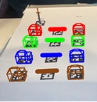

# AR Catan Project

## Abstract
This project provides an augmented reality (AR) version of the game Settlers of Catan using OpenCV. It enables users to play the game with a computer, camera, and printed ArUco markers. The AR setup includes models for each of the game’s tiles, cards, and user pieces.

## Table of Contents
1. [Introduction](#introduction)
2. [Prior Work](#prior-work)
3. [Methods](#methods)
    - [Camera Calibration](#camera-calibration)
    - [ArUco Based AR](#aruco-based-ar)
    - [Homography](#homography)
4. [Experiments and Results](#experiments-and-results)
5. [References](#references)
6. [Appendix](#appendix)

## Introduction
Rendering virtual objects into an image and creating virtual cards for a game like Catan involves mapping 3D world points into 2D image points. This requires understanding both intrinsic and extrinsic parameters of the camera. This project leverages these concepts to project 3D objects into scenes and establish relationships between virtual cards and the camera's frame using ArUco markers.

## Prior Work
1. **Zhang, 2000**: Proposed a robust method for camera calibration using a planar pattern in different orientations.
2. **Marchand et al, 2016**: Discussed various methods for pose estimation, emphasizing accuracy through minimizing reprojection error using non-linear approaches.
3. **Parekh et al, 2020**: Conducted a meta-analysis showing the positive impact of AR in various fields, noting that tangible AR interactions enhance gaming experiences.

## Methods
### Camera Calibration
The first step is to establish the camera's intrinsic parameters matrix. The calibration process uses images of a ChArUco board to solve for the matrix. Distortion is accounted for using a vector of distortion coefficients. The calibration process is implemented in `calibrate_camera.cpp`, and a printable ChArUco board can be generated using `generate_board.cpp`.

### ArUco Based AR
Using the XML file from calibration, the AR environment uses ArUco markers for mapping objects into video frames. Markers are generated with `generate_markers.cpp` and organized in a hash map by game piece name and marker ID. Pose estimation and projection of 3D points are handled using OpenCV functions `solvePNP()` and `projectPoints()`.

### Homography
To map the game's cards and tiles, planar homography is used to project the 2D points of a card image into the virtual world. This is implemented using OpenCV’s `findHomography()` function.

## Experiments and Results
All game components were successfully rendered, with a notable issue in mapping hexagonal tiles due to white space along the sides. Despite challenges, the game can be played using a laptop or other computer with a camera. The project demonstrates the potential for AR applications in gaming and other fields, including mobile apps and headsets.

## References
1. Zhang, Z., "A flexible new technique for camera calibration," IEEE Transactions on Pattern Analysis and Machine Intelligence, 2000. doi:10.1109/34.888718
2. Marchand, E., Uchiyama, H., and Spindler, F., "Pose estimation for augmented reality: A hands-on survey," IEEE Transactions on Visualization and Computer Graphics, 2016. doi:10.1109/tvcg.2015.2513408
3. OpenCV, "Pose computation overview," https://docs.opencv.org/4.x/d5/d1f/calib3d_solvePnP.html
4. Parekh, P., Patel, S., Patel, N., and Shah, M., "Systematic Review and meta-analysis of augmented reality in medicine, retail, and games," Visual Computing for Industry, Biomedicine, and Art, 2020. doi:10.1186/s42492-020-00057-7
5. OpenCV, "Camera calibration and 3D reconstruction," https://docs.opencv.org/4.x/d9/d0c/group__calib3d.html
6. Farid, H., "Image analysis: Homography: Planar homography," YouTube, https://www.youtube.com/watch?v=1PJZNCU9yRo
7. OpenCV, "Basic concepts of the homography explained with code," https://docs.opencv.org/4.x/d9/dab/tutorial_homography.html
8. Catan Collector, "Deluxe cards," https://catancollector.com/images/2022/03/11/deluxecards.jpg

## How to Use
1. **Camera Calibration**: Print the ChArUco board using `generate_board.cpp` and run `calibrate_camera.cpp` to obtain the camera's intrinsic parameters.
2. **Generate Markers**: Use `generate_markers.cpp` to create and print ArUco markers.
3. **Run the AR Game**: Use the generated XML file and printed markers to run the AR Catan game on your computer.

## Appendix

### Resource Card and Hex Examples

### Game Piece Examples

